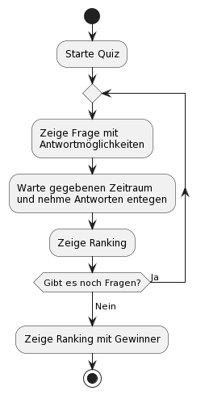

[[section-introduction-and-goals]]
==	Einführung und Ziele
=== Aufgabenstellung

Die Quiz-API soll es Dozenten ermöglichen mit den Studenten regelmäßig ein Quiz machen, um den gelehrten Stoff zur Prüfungsvorbereitung zu wiederholen.

Das Ziel des Projektes soll es sein, eine funktionierende Web-App zu haben, mit der der Dozent das Wissen der Studierenden abfragen kann. Um einen Anreiz für die Studierenden zu schaffen, soll eine Gamification Komponente integriert sein. Die Komponente berechnet einen Punktestand für jeden Teilnehmer. Der Punktestand hängt von 2 Faktoren ab:

- Korrekte Antwort (Feste Punktzahl)
- Antwortzeit (Multiplikator). Das Quiz soll keine Studierenden vorführen. Daher muss jeder Studierende mit einem Nickname teilnehmen können.

Der Dozent muss für sein Quiz ein Raum erstellen können, den er mit Fragen und möglichen Antworten befüllen kann. Außerdem muss er eine Zeit angeben können, in der die Frage beantwortet werden soll. Nur der Dozent darf Zugriff auf seine Fragen-Antwort-Paare haben. Andernfalls kann ein Studierender mogeln und die richtigen Antworten selber abfragen.

Der Dozent muss die Raumnummer anzeigen können (z. B. als QR-Code), damit die Studierenden sich in dem Raum zum Spielen anmelden können. Über die Seite muss er auch das Quiz starten können. Sobald die Zeit für eine Frage abgelaufen ist, soll das Ranking mit der Punktzahl der Studierenden angezeigt werden. Danach kommt die nächste Frage.

Wenn alle Fragen beantwortet wurden, müssen von allen Teilnehmern der Punktestand zusammengerechnet werden und in einer Rangfolge angezeigt werden.

.Zustandsdiagram des Quiz-Ablaufs

.Funktionale Anforderungen an die Quiz-API
|===
|ID |Anforderung |Erklärung

|M-1
|Raumerstellung
|Der Dozent muss aus einem Set aus Fragen einen Raum für das Quiz erzeugen können.

|M-2
|Punktestand-Berechnung
|Aus der richtigen Antwort und Antwortzeit muss ein Punktestand für den Spieler berechnet werden.

|M-3
|Fragen erstellen
|Der Dozent muss Fragen für das Quiz mit möglichen Antworten und Antwortzeit erstellen können.

|M-4
|Zugangslink
|Beim Erstellen eines Raumes muss ein QR-Code angezeigt werden, der es den Spielern ermöglicht auf das Quiz zu kommen.

|M-5
|Zeitfenster einhalten
|Das System darf nach dem Ende des Zeitfensters der Frage keine Antworten mehr entgegennehmen.

|M-6
|Teilnehmer
|Die Studenten müssen an dem Quiz ohne Account teilnehmen können.

|M-7
|Endergebnis
|Das Endergebnis muss ein Ranking aller Teilnehmer anzeigen.

|M-8
|Nicknames
|Das Quiz muss Nicknames der Spieler entgennehmen.

|O-1
|Animation
|Das Quiz kann nach jeder Frage eine kleine Animation anzeigen.

|O-2
|Fragekatalog
|Fragen können einem oder mehreren Fragekatalogen zugeordnet werden.

|O-2
|Auswahl aus Fragekatalog
|Man kann angeben wie viele Fragen aus einem Katalog in dem Quiz vorkommen sollen.
|===
_Legende: M = Muss, O = Optional (nice to have)_

=== Qualitätsziele

.Qualitätsziele
|===
|ID |Prio |Qualitätsziel |Erläuterung

|Q-1
|1
|Zuverlässigkeit
|Das Quiz läuft fehlerfrei durch alle Fragen durch.

|Q-2
|2
|Korrektheit
|Das Quiz berechnet den Punktestand der Teilnehmer zuverlässig und addiert die Punkte aller Fragen korrekt auf.

|Q-3
|3
|Sicherheit
|Die Fragen dürfen nur von dem Ersteller eingesehen werden.

|Q-4
|4
|Flexibilität
|Die Fragen eines Quiz können jederzeit angepasst und erweitert werden.
|===

=== Stakeholder

.Stakeholder
|===
|Rolle |Ziel |Erwartungshaltung

|Dozent
|Möchte nach jedem abgeschlossenen Kapitel das Wissen der Studierenden abfragen.
|Hat an Architektur des Systems kein Interesse, möchte lediglich das Endprodukt einsetzen.

|Studierende
|Möchte sich mit seinen Kommilitonen duellieren.
|Hat an Architektur des Systems kein Interesse, möchte lediglich das Endprodukt benutzen.

|Software-Architekt
|Möchte ein robustes System designen und bauen.
|Ausfallsicheres und Wartungsarmes Produkt.
|===
