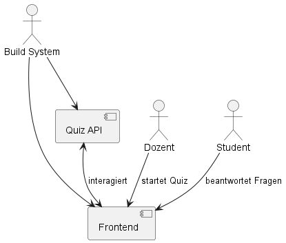
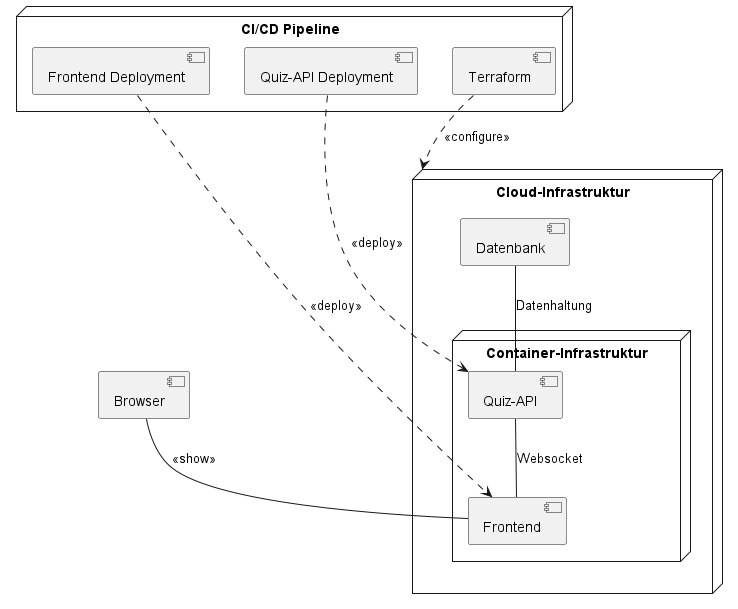

[[section-system-scope-and-context]]
== Kontextabgrenzung
=== Fachlicher Kontext

.Kontext
|===
|Nachbar |Beschreibung

|Dozent
|Dozent erstellt Quiz-Kataloge und startet ein Quiz.

|Student
|Ein Student beantwortet die Fragen eines offenen Quiz.

|Build System
|Das Build System baut und deployed die Anwendung.

|Quiz API
|Die Quiz API ist das Backend und übernimmt das Spielsystem.

|Frontend
|Das Frontend ist die Schnittstelle zwischen den Benutzern und dem Backend.
|===

=== Technischer Kontext

[plantuml, target=diagram-component, format=png]

.Kontext
|===
|Nachbar |Beschreibung

|CI/CD Pipeline
|Pipelines die für den Bau und Auslieferung der Infrastruktur nötig sind.

|Cloud Infrastruktur
|Infrastruktur-Komponente, die eine Umgebung für die ausführbaren System-Komponenten und Middleware liefert.

|Container Infrastruktur
|Manager für die Laufzeitumgebung der System-Komponenten
|===
