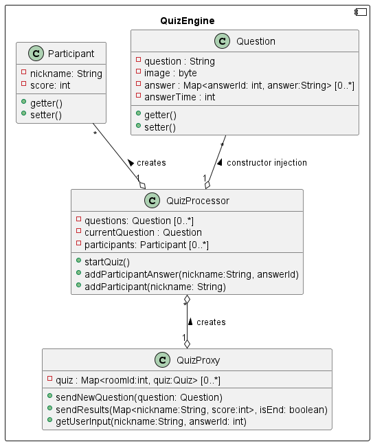

[[section-building-block-view]]
== Bausteinsicht
=== Whitebox Gesamtsystem Level 1

Die Architektur ist nach dem klassischen Client-Server-Prinzip strukturiert. Das Frontend nimmt die User-Interaktion entgegen und sendet die Informationen über den Websocket an das Quiz-API. Das Quiz-API reagiert auf den Input und sendet die Updates aus dem laufenden Quiz an das Frontend.

.Enthaltene Blackboxes
|===
|Baustein |Beschreibung

|Quiz-API
|Das Backend erledigt die Abwicklung der Fragen und die Berechnung des Punktestands für jeden Spieler.

|Frontend
|Das Frontend zeigt das Quiz mit den Frage-Antwort-Paaren und verstreichender Zeit an. Es nimmt den User-Input entgegen und sendet diesen zur Verarbeitung an das Quiz-API.
|===

=== Bausteinansicht Level 2
==== Whitebox Quiz-API

.Enthaltene Blackboxes
|===
|Baustein |Beschreibung

|QuizController
|Nimmt Request zum Start des Quiz entgegen und triggert daraufhin die QuizEnging das Quiz zu starten.

|QuizEngine
|Führt das Quiz durch und berechnet den Punktestand. Nutzt das QuizRepository um sich den Quiz-Katalog aus der Datenbank zu laden. Über den MessagingService sendet es die Frage-Antwort-Paare an das Frontend

|MessagingService
|Nimmt die Messages von dem Frontend entgegen und leitet sie an die QuizEngine weiter. Außerdem sendet es die Messages von der QuizEngine an das Frontend.

|QuizRepository
|Interagiert mit der Datenbank.
|===

=== Bausteinansicht Level 3
==== Whitebox QuizEngine

Dieser Baustein handelt den Quiz-Prozess ab. Die QuizEngine instanziiert bei einer Raumeröffnung einen QuizProcessor. Dabei befüllt es den QuizProcessor mit einer Liste an Questions.

.Enthaltene Blackboxes
|===
|Baustein |Beschreibung

|Participant
|Datenklasse für einen Mitspieler.

|Question
|Datenklasse für die Frage-Antwort-Paare.

|QuizProcessor
|Handelt das Quiz ab und berechnet bei einem UserInput den Punktestand.

|QuizProxy
|Proxy für alle Quiz-Räume. Delegiert die Updates von und zu den Usern.
|===
