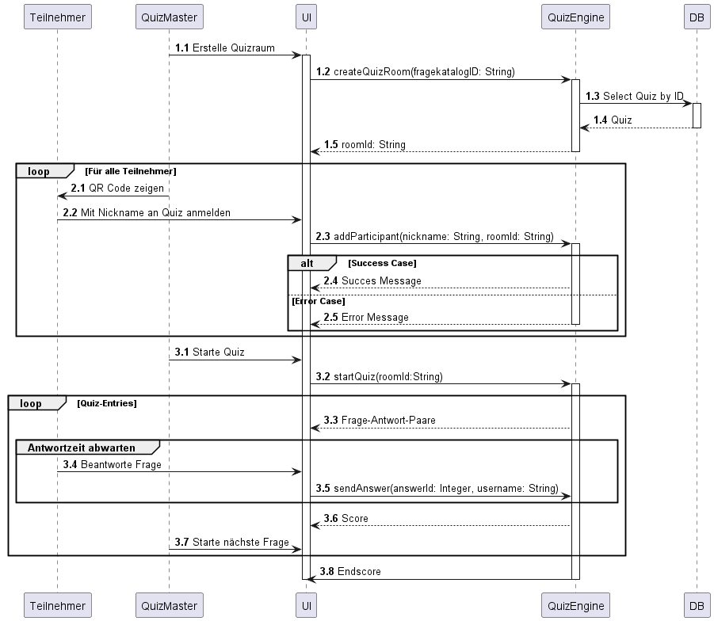

[[section-runtime-view]]
== Laufzeitsicht
=== Ablauf Quiz

.Ablauf
|===
|# |Beschreibung

|1.1
|Der Raum wird über das Frontend mit einem Fragenkatalog erstellt.

|1.2
|Die QuizEngine holt sich den Fragenkatalog aus der Datenbank.

|1.3
|Die Datenbank liefert den gesuchten Fragenkatalog zurück.

|1.4
|Die QuizEngine erstellt den Raum und liefert die RaumID.

|2.1
|Das Quiz wird über das Frontend gestartet.

|2.2
|Die QuizEngine liefert nacheinander alle Frage-Antwort-Paare bis der Fragenkatalog komplett durchlaufen ist.

|2.3
|Alle Teilnehmer Antworten während innerhalb der Antwortzeit.

|2.4
|Nach abgelaufener Antwortzeit liefert die GameEngine den Score für alle Teilnehmer aus.

|2.5
|Nachdem alle Fragen durchlaufen wurden, liefert die GameEngine den Gesamtscore aus.
|===
